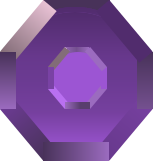
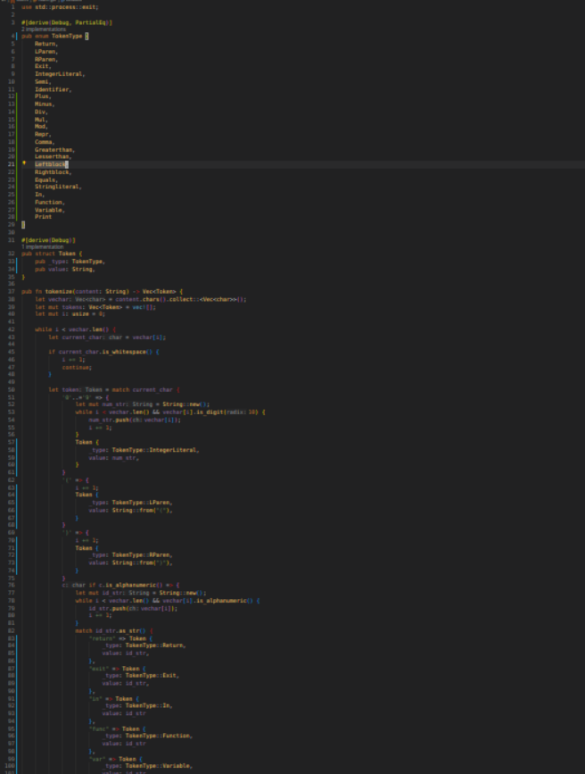

Amethyst
===

===


(All the code might not work because it is not tested)
====================================================
- 1.0 The Lexer

The Lexer is the part where it collects the input and makes them into tokens for example `1 + 2`, So here its gonna go throught the code ive given in this case `1 + 2` and for each character its gonna make a token for example the tokens might look like a struct:
```
enum TokenType {
    IntegerLiteral
    Plus
}
struct Token {
    _type: TokenType
    value: String
}
```

so the lexer is made like this:
```
fn tokenize(contents: String) -> Vec<Token> {
    i = 0
    let tokens: Vec<Token> = vec![];
    while i < contents.len() {
        let token = match contents[i] {
            '0'..='9' => {
                start = i
                i+=1
                // while its not an integer look for it fully and then tell the whole integer value
                while !contents[i].is_digit {
                    i+=1
                }
                Token { _type: TokenType::IntegerLiteral, value: contents[start..i].iter().collect::<String>() }
            }
            '+' => {
                i+=1
                Token { _type: TokenType::Plus, value: String::from("+") }
            }
            _ => // error We can put println!("Unexpected token {}", contents[i]);
        }
        tokens.push(token)
        i+=1
        tokens
    }
}
```
now if we try it should give an output like this:
`[Token { _type: IntegetLiteral, value: "1" }, Token { _type: Plus, value: "+" }, Token { _type: IntegerLiteral, value: "2" }]`


this is the code used in the lexer:
```
use std::process::exit;

#[derive(Debug, PartialEq)]
pub enum TokenType {
    Return,
    LParen,
    RParen,
    Exit,
    IntegerLiteral,
    Semi,
    Identifier,
    Plus,
    Minus,
    Div,
    Mul,
    Mod,
    Repr,
    Comma,
    Greaterthan,
    Lesserthan,
    Leftblock,
    Rightblock,
    Equals,
    Stringliteral,
    In,
    Function,
    Variable,
    Print
}

#[derive(Debug)]
pub struct Token {
    pub _type: TokenType,
    pub value: String,
}

pub fn tokenize(content: String) -> Vec<Token> {
    let vechar = content.chars().collect::<Vec<char>>();
    let mut tokens: Vec<Token> = vec![];
    let mut i: usize = 0;

    while i < vechar.len() {
        let current_char = vechar[i];

        if current_char.is_whitespace() {
            i += 1;
            continue;
        }

        let token = match current_char {
            '0'..='9' => {
                let mut num_str = String::new();
                while i < vechar.len() && vechar[i].is_digit(10) {
                    num_str.push(vechar[i]);
                    i += 1;
                }
                Token {
                    _type: TokenType::IntegerLiteral,
                    value: num_str,
                }
            }
            '(' => {
                i += 1;
                Token {
                    _type: TokenType::LParen,
                    value: String::from("("),
                }
            }
            ')' => {
                i += 1;
                Token {
                    _type: TokenType::RParen,
                    value: String::from(")"),
                }
            }
            c if c.is_alphanumeric() => {
                let mut id_str = String::new();
                while i < vechar.len() && vechar[i].is_alphanumeric() {
                    id_str.push(vechar[i]);
                    i += 1;
                }
                match id_str.as_str() {
                    "return" => Token {
                        _type: TokenType::Return,
                        value: id_str,
                    },
                    "exit" => Token {
                        _type: TokenType::Exit,
                        value: id_str,
                    },
                    "in" => Token {
                        _type: TokenType::In,
                        value: id_str
                    },
                    "func" => Token {
                        _type: TokenType::Function,
                        value: id_str
                    },
                    "var" => Token {
                        _type: TokenType::Variable,
                        value: id_str
                    },
                    "print" => Token {
                        _type: TokenType::Print,
                        value: id_str
                    },
                    _ => Token {
                        _type: TokenType::Identifier,
                        value: id_str,
                    },
                }
            }
            ';' => {
                i += 1;
                Token {
                    _type: TokenType::Semi,
                    value: current_char.to_string(),
                }
            }
            '+' => {
                i += 1;
                Token {
                    _type: TokenType::Plus,
                    value: current_char.to_string(),
                }
            }
            '-' => {
                i+=1;
                Token {
                    _type: TokenType::Minus,
                    value: current_char.to_string()
                }
            }
            '*' => {
                i+=1;
                Token {
                    _type: TokenType::Mul,
                    value: current_char.to_string()
                }
            }
            '/' => {
                i+=1;
                Token { _type: TokenType::Div, value: current_char.to_string() }
            },
            ':' => {
                i+=1;
                Token { _type: TokenType::Repr, value: current_char.to_string() }
            },
            '%' => {
                i+=1;
                Token { _type: TokenType::Mod, value: current_char.to_string() }
            },
            ',' => {
                i+=1;
                Token { _type: TokenType::Comma, value: current_char.to_string() }
            }
            '>' => {
                i+=1;
                Token { _type: TokenType::Greaterthan, value: current_char.to_string()}
            }
            '<' => {
                i+=1;
                Token { _type: TokenType::Lesserthan, value: current_char.to_string() }
            }
            '{' => {
                i+=1;
                Token { _type: TokenType::Leftblock, value: current_char.to_string() }
            }
            '}' => {
                i+=1;
                Token { _type: TokenType::Rightblock, value: current_char.to_string() }
            }
            '=' => {
                i+=1;
                Token { _type: TokenType::Equals, value: current_char.to_string() }
            }
            '"' => {
                i+=1;
                let start = i;
                while i < vechar.len() && vechar[i] != '"' {
                    i+=1;
                }
                let chars = vechar[start..i].iter().collect::<String>();
                i+=1;
                Token { _type: TokenType::Stringliteral, value: chars }
            }
            _ => {
                eprintln!("Unexpected token {}", current_char);
                exit(54);
            }
        };

        tokens.push(token);
    }

    tokens
}

```

this is a screenshot of it:



there's a lot right!, dont worry were here.

- 1.1 Parser

The parser is the part of the language that takes the tokens and makes an expression for each token

for example an arithmetic expression:
```1 + 1```

Should produce the following tokens into a Vector:
```[Token { _type: IntegerLiteral, _value: 1 }, Token { _type: Plus, _value: "+" }, Token { _type: IntegerLiteral, _value: 1 }]```

These tokens can be further parsed into meaningful expressions
Such as the following:
```
Program {
    body: [
        BinaryExpression {
            left: 1,
            operator: Operators::Plus,
            right: 1,
        }
    ]
}
```
here is an example snippet that can be used:
```parser.rs

struct Parser {};

impl Parser {
    // Parser's functions are displayed here.
}
```
```ast.rs
enum Operators {
    Addition,
    Subtraction,
    Multiplication,
    Division,
    Modulus,
    /* Other Operators */
}
enum Expr {
    BinaryExpression { left: f64, op: Operators, right: f64 }
    IdentifierLiteral { value: String }
    IntegerLiteral { value: f64 }
}
struct Program {
    body: Vec<Expr>;
};
```