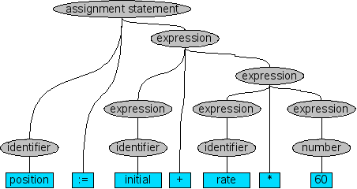

Amethyst
===

===

Contents
========
# <center><a>Lexer</a> |</center>

1.0 The Lexer
==

The Lexer is the part where it collects the input and makes them into tokens for example `1 + 2`, So here its gonna go throught the code ive given in this case `1 + 2` and for each character its gonna make a token for example the tokens might look like a struct:
```rust
enum TokenType {
    IntegerLiteral
    Plus
}
struct Token {
    _type: TokenType
    value: String
}
```

so the lexer is made like this:
```rust
fn tokenize(contents: String) -> Vec<Token> {
    i = 0
    let tokens: Vec<Token> = vec![];
    while i < contents.len() {
        let token = match contents[i] {
            '0'..='9' => {
                start = i
                i+=1
                // while its not an integer look for it fully and then tell the whole integer value
                while !contents[i].is_digit {
                    i+=1
                }
                Token { _type: TokenType::IntegerLiteral, value: contents[start..i].iter().collect::<String>() }
            }
            '+' => {
                i+=1
                Token { _type: TokenType::Plus, value: String::from("+") }
            }
            _ => // error We can put println!("Unexpected token {}", contents[i]);
        }
        tokens.push(token)
        i+=1
        tokens
    }
}
```
now if we try it should give an output like this:
`[Token { _type: IntegetLiteral, value: "1" }, Token { _type: Plus, value: "+" }, Token { _type: IntegerLiteral, value: "2" }]`


this is the code used in the lexer:
```rust
use std::process::exit;

#[derive(Debug, PartialEq)]
pub enum TokenType {
    Return,
    LParen,
    RParen,
    Exit,
    IntegerLiteral,
    Semi,
    Identifier,
    Plus,
    Minus,
    Div,
    Mul,
    Mod,
    Repr,
    Comma,
    Greaterthan,
    Lesserthan,
    Leftblock,
    Rightblock,
    Equals,
    Stringliteral,
    In,
    Function,
    Variable,
    Print
}

#[derive(Debug)]
pub struct Token {
    pub _type: TokenType,
    pub value: String,
}

pub fn tokenize(content: String) -> Vec<Token> {
    let vechar = content.chars().collect::<Vec<char>>();
    let mut tokens: Vec<Token> = vec![];
    let mut i: usize = 0;

    while i < vechar.len() {
        let current_char = vechar[i];

        if current_char.is_whitespace() {
            i += 1;
            continue;
        }

        let token = match current_char {
            '0'..='9' => {
                let mut num_str = String::new();
                while i < vechar.len() && vechar[i].is_digit(10) {
                    num_str.push(vechar[i]);
                    i += 1;
                }
                Token {
                    _type: TokenType::IntegerLiteral,
                    value: num_str,
                }
            }
            '(' => {
                i += 1;
                Token {
                    _type: TokenType::LParen,
                    value: String::from("("),
                }
            }
            ')' => {
                i += 1;
                Token {
                    _type: TokenType::RParen,
                    value: String::from(")"),
                }
            }
            c if c.is_alphanumeric() => {
                let mut id_str = String::new();
                while i < vechar.len() && vechar[i].is_alphanumeric() {
                    id_str.push(vechar[i]);
                    i += 1;
                }
                match id_str.as_str() {
                    "return" => Token {
                        _type: TokenType::Return,
                        value: id_str,
                    },
                    "exit" => Token {
                        _type: TokenType::Exit,
                        value: id_str,
                    },
                    "in" => Token {
                        _type: TokenType::In,
                        value: id_str
                    },
                    "func" => Token {
                        _type: TokenType::Function,
                        value: id_str
                    },
                    "var" => Token {
                        _type: TokenType::Variable,
                        value: id_str
                    },
                    "print" => Token {
                        _type: TokenType::Print,
                        value: id_str
                    },
                    _ => Token {
                        _type: TokenType::Identifier,
                        value: id_str,
                    },
                }
            }
            ';' => {
                i += 1;
                Token {
                    _type: TokenType::Semi,
                    value: current_char.to_string(),
                }
            }
            '+' => {
                i += 1;
                Token {
                    _type: TokenType::Plus,
                    value: current_char.to_string(),
                }
            }
            '-' => {
                i+=1;
                Token {
                    _type: TokenType::Minus,
                    value: current_char.to_string()
                }
            }
            '*' => {
                i+=1;
                Token {
                    _type: TokenType::Mul,
                    value: current_char.to_string()
                }
            }
            '/' => {
                i+=1;
                Token { _type: TokenType::Div, value: current_char.to_string() }
            },
            ':' => {
                i+=1;
                Token { _type: TokenType::Repr, value: current_char.to_string() }
            },
            '%' => {
                i+=1;
                Token { _type: TokenType::Mod, value: current_char.to_string() }
            },
            ',' => {
                i+=1;
                Token { _type: TokenType::Comma, value: current_char.to_string() }
            }
            '>' => {
                i+=1;
                Token { _type: TokenType::Greaterthan, value: current_char.to_string()}
            }
            '<' => {
                i+=1;
                Token { _type: TokenType::Lesserthan, value: current_char.to_string() }
            }
            '{' => {
                i+=1;
                Token { _type: TokenType::Leftblock, value: current_char.to_string() }
            }
            '}' => {
                i+=1;
                Token { _type: TokenType::Rightblock, value: current_char.to_string() }
            }
            '=' => {
                i+=1;
                Token { _type: TokenType::Equals, value: current_char.to_string() }
            }
            '"' => {
                i+=1;
                let start = i;
                while i < vechar.len() && vechar[i] != '"' {
                    i+=1;
                }
                let chars = vechar[start..i].iter().collect::<String>();
                i+=1;
                Token { _type: TokenType::Stringliteral, value: chars }
            }
            _ => {
                eprintln!("Unexpected token {}", current_char);
                exit(54);
            }
        };

        tokens.push(token);
    }

    tokens
}

```

this is a screenshot of it:


there's a lot right!, dont worry we finished it.

1.1 Parser
===

Inspiration 💫




You can straightly understand whats happening here if your smart.

This is the one and only AST!

Dont be scared of the diagram because its not even scary.

So it works like this

first it takes the tokens generated by the lexer we made and produces a tree

just like every tree it has nodes

so a statement is a nodeType of it

for example in:
```rust
while var i = 0 < 20 {
    i ++;
}
```

the whole thing is a statement

each statement has a statement kind

here the tree might look like this:
```rust
WhileStatment:
  SpecialVariables: [i: i32]
  UnaryExpr: Increment: i
  JumpIf: i == 20
```

a statement kind can be an expression or another statement


Its implementing time?!
